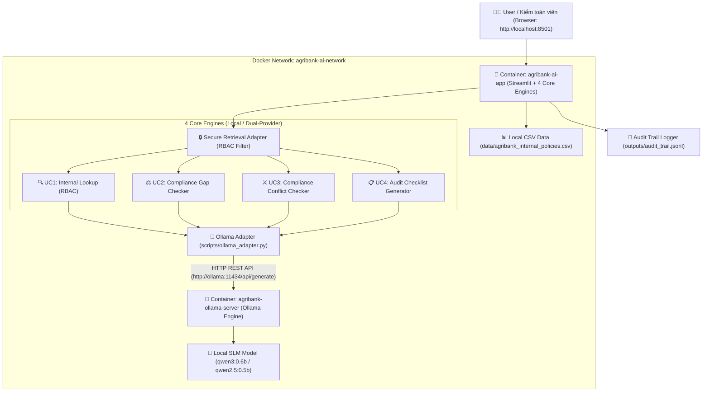

# BÀI THỰC HÀNH BUỔI 19
# Đóng gói Toàn diện Local AI System với Docker, Ollama (Model Qwen3:0.6B) & Streamlit Dashboard 4-in-1

## Mục tiêu

Buổi 19 tập trung vào việc chuyển đổi toàn bộ kiến trúc RAG Bảo mật & Kiểm toán Ngân hàng Agribank (kế thừa từ Buổi 17 & 18) từ việc sử dụng Cloud Gemini API sang **Mô hình Local AI hoàn toàn Offline**, bảo mật dữ liệu tuyệt đối (On-Premise) sử dụng **Ollama** và **Model Qwen3:0.6B** (hoặc Qwen2.5-0.5B / Qwen2.5-1.5B), đồng thời đóng gói toàn bộ hệ thống bằng **Docker Containerization**.

```text
Hạ tầng Cloud Gemini API (Buổi 17/18) 
  ↓ (Chuyển đổi Buổi 19)
Local SLM Model (Qwen3:0.6B) + Ollama Container + Streamlit App Container (Docker Compose)
```

Sản phẩm cuối buổi bao gồm đầy đủ **4 Use Cases Nghiệp vụ Ngân hàng**:

```text
Hệ thống Local AI Containerized bao gồm:
+ Ollama Service Container (Chạy local model Qwen3:0.6b trên port 11434)
+ Agribank AI Web Application Container (Streamlit App + Core RAG Engines trên port 8501)
+ Ollama API Adapter (scripts/ollama_adapter.py) hỗ trợ Dual-Provider Switch (Ollama / Gemini)
+ Vận hành trọn bộ 4 Core AI Engines:
  - UC1: AI Tra cứu Quy định Nội bộ có phân quyền RBAC (scripts/internal_lookup.py)
  - UC2: AI Đánh giá Khoảng cách Tuân thủ - Compliance Gap (scripts/compliance_gap.py)
  - UC3: AI So sánh chéo & Phát hiện Mâu thuẫn Quy định (scripts/compliance_checker.py)
  - UC4: AI Tự động Sinh Checklist Kiểm toán Tuân thủ (scripts/audit_checklist_gen.py)
+ Bộ Docker Configuration: Dockerfile, docker-compose.yml, requirements.txt
+ Kịch bản nghiệm thu Docker & Security Verification (outputs/b19_docker_acceptance_report.md)
```

---

# 1. Bảng Tổng Hợp 4 Use Cases Nghiệp Vụ

| Use Case | Tên Chức Năng | File Engine | Đầu Vào | Cơ Chế Bảo Vệ / Guardrail | Đầu Ra |
|---|---|---|---|---|---|
| **UC1** | **Tra cứu Quy định Nội bộ** | `scripts/internal_lookup.py` | Câu hỏi tra cứu nghiệp vụ, Role người dùng | **Pre-retrieval RBAC Filter**: Chỉ đưa chunks được cấp quyền vào context | Câu trả lời kèm Citation chính xác, chặn rò rỉ dữ liệu mật |
| **UC2** | **Đánh giá Khoảng cách Tuân thủ** | `scripts/compliance_gap.py` | Yêu cầu pháp lý từ Thông tư NHNN | **Evidence Cross-Match**: So sánh bằng chứng 2 phía | Phân loại `DAP_UNG`, `THIEU`, `CHENH_LECH` + `NEEDS_HUMAN_REVIEW` |
| **UC3** | **Phát hiện Xung đột Quy định** | `scripts/compliance_checker.py` | Cặp điều khoản (Nội bộ vs NHNN / Nội bộ vs Nội bộ) | **Conflict Severity Assessment**: Ép kiểu JSON phân tích mức độ | Mã xung đột, mức độ rủi ro (HIGH/MED/LOW), đề xuất chỉnh sửa |
| **UC4** | **Sinh Checklist Kiểm toán** | `scripts/audit_checklist_gen.py` | Miền nghiệp vụ & Gói tài liệu quy định | **Auditor Structured Guide**: Trích xuất thủ tục kiểm tra thực tế | Bảng danh mục câu hỏi & thủ tục kiểm toán hiện trường |

---

# 2. Kiến trúc Hệ thống Docker & Local AI



---

# 3. Nguyên tắc bắt buộc

- **Hoàn toàn Offline & Bảo mật:** Dữ liệu quy định nội bộ và prompt tra cứu không được rời khỏi môi trường mạng cục bộ khi chạy chế độ `ollama`.
- **Không sửa dữ liệu nguồn:** Giữ nguyên các tệp `data/agribank_internal_policies.csv` và `data/chunks_combined_secure.csv`.
- **Chuyển đổi linh hoạt (Dual Provider):** Cả 4 engines phải hỗ trợ biến môi trường `LLM_PROVIDER` (`ollama` hoặc `gemini`) trong `.env` để dễ dàng switch giữa Cloud API và Local Ollama.
- **RBAC Pre-retrieval Enforced:** Tài liệu không thuộc quyền hạn của vai trò người dùng (ví dụ: `Staff` truy cập dữ liệu mật CAR/Risk của `Risk_Manager`) phải bị chặn từ tầng truy xuất, không đưa vào context của LLM.
- **Trích dẫn chính xác & Human Review:** 100% kết quả từ 4 Use Cases phải đính kèm `citation` chuẩn xác và cờ `NEEDS_HUMAN_REVIEW`.
- **Đóng gói Chuẩn Docker:** Chạy toàn bộ hệ thống chỉ với một lệnh duy nhất `docker compose up -d`.

---

# 4. Cấu trúc project Buổi 19

```text
buoi_19/
├── .env                              # Khai báo LLM_PROVIDER=ollama, OLLAMA_BASE_URL, OLLAMA_MODEL
├── Dockerfile                        # Dockerfile đóng gói ứng dụng Streamlit & RAG Engines
├── docker-compose.yml                # Docker Compose orchestrate Ollama & App containers
├── requirements.txt                  # Python dependencies cho Container
├── README.md                         # Hướng dẫn khởi chạy & vận hành
├── Buoi_19.md                        # Tài liệu hướng dẫn & Prompt thực hành chi tiết
├── data/
│   ├── agribank_internal_policies.csv # 24 quy định nội bộ Agribank
│   └── chunks_combined_secure.csv    # 811 chunks quy định pháp luật & nội bộ
├── scripts/
│   ├── ollama_adapter.py             # Ollama REST API Adapter Client (Offline SLM)
│   ├── internal_lookup.py            # Core Engine UC1: Tra cứu quy định nội bộ (RBAC Filter)
│   ├── compliance_gap.py             # Core Engine UC2: Đánh giá khoảng cách tuân thủ
│   ├── compliance_checker.py        # Core Engine UC3: So sánh chéo & phát hiện xung đột
│   ├── audit_checklist_gen.py       # Core Engine UC4: Tự động sinh checklist kiểm toán
│   ├── secure_retrieval_adapter.py  # Bộ lọc phân quyền RBAC tiền truy xuất
│   ├── audit_logger.py              # Ghi vết kiểm toán bảo mật (Audit Trail)
│   ├── security_tests_b19.py        # Bộ 6 bài kiểm thử an ninh & bảo mật
│   └── verify_b19_docker.py          # Kịch bản nghiệm thu Docker & 4 Use Cases Buổi 19
├── outputs/
│   ├── b19_docker_acceptance_report.md # Báo cáo nghiệm thu tự động
│   ├── compliance_conflicts.csv
│   ├── audit_checklist_results.csv
│   └── audit_trail.jsonl             # File log truy vết hệ thống
└── app.py                           # Web UI Streamlit 5-in-1 (UC1, UC2, UC3, UC4, Audit Trail)
```

---

# 5. Tệp cấu hình `.env` cho Buổi 19

```env
# Buổi 19 Local Ollama & Docker Setup
LLM_PROVIDER=ollama
OLLAMA_BASE_URL=http://localhost:11434
OLLAMA_MODEL=qwen3:0.6b

# Cloud Gemini Fallback (Optional)
GEMINI_API_KEY=YOUR_GEMINI_API_KEY_FREE
LLM_API_KEY=YOUR_GEMINI_API_KEY_FREE
LLM_MODEL=gemini-3.6-flash

APP_ENV=training
```

---

# 6. Các Prompt Thực Hành Buổi 19

---

### PROMPT SETUP — Kiểm tra Môi trường Docker, Ollama & Dữ liệu

```text
Kiểm tra giúp tôi môi trường Docker và các tệp dữ liệu Buổi 19.

Kiểm tra:
- Lệnh `docker --version` và `docker compose version` trên hệ thống;
- Đảm bảo các file dữ liệu data/agribank_internal_policies.csv và data/chunks_combined_secure.csv sẵn sàng;
- Đảm bảo thư mục scripts/ và outputs/ sẵn sàng;
- File .env đã có tham số LLM_PROVIDER=ollama và OLLAMA_MODEL=qwen3:0.6b chưa.

Báo kết quả:
DOCKER READY: YES / NO
DATA READY: YES / NO
ENV CONFIG READY: YES / NO
```

---

### PROMPT 1 — Xây dựng Ollama API Adapter Client (`scripts/ollama_adapter.py`)

```text
Tạo file:
scripts/ollama_adapter.py

Yêu cầu:
1. Xây dựng lớp `OllamaClient` giao tiếp trực tiếp với Ollama REST API (`/api/generate` và `/api/tags`).
2. Tự động đọc đường dẫn OLLAMA_BASE_URL (mặc định http://localhost:11434 hoặc http://ollama:11434) và OLLAMA_MODEL (mặc định qwen3:0.6b).
3. Cung cấp hàm `check_health()` để kiểm tra Ollama Server online/offline và danh sách models đã tải.
4. Cung cấp hàm `generate(prompt, system="", format_json=False, temperature=0.2)` gửi prompt và nhận văn bản / JSON từ mô hình Qwen3:0.6b.
5. Hỗ trợ fallback an toàn dạng rule-engine khi Ollama Server chưa bật.

Chạy kiểm tra thử nghiệm module:
python scripts/ollama_adapter.py

Xuất báo cáo nhỏ:
OLLAMA ADAPTER: PASS / FAIL
OLLAMA SERVER ONLINE: YES / NO
```

---

### PROMPT 2 — Nâng cấp Cả 4 Core Engines Tương thích Local Model (`scripts/`)

```text
Cập nhật toàn bộ 4 file backend engines trong scripts/ hỗ trợ Dual-Provider (Ollama Local SLM / Gemini Cloud):

1. scripts/internal_lookup.py (UC1 - Tra cứu Quy định Nội bộ có RBAC Pre-filtering)
   - Lọc chunks theo `allowed_roles` trước khi gửi vào LLM context;
   - Nếu không có quyền hoặc không tìm thấy thông tin, trả đúng câu chuẩn: "Không tìm thấy đủ thông tin trong phạm vi tài liệu được phép truy cập."
   - Đính kèm Citation văn bản gốc và ghi Audit Log.

2. scripts/compliance_gap.py (UC2 - Đánh giá Khoảng cách Tuân thủ)
   - So sánh yêu cầu từ Thông tư NHNN với quy định nội bộ Agribank;
   - Phân loại: DAP_UNG / THIEU / CHENH_LECH / CHUA_DU_BANG_CHUNG.
   - Gắn cờ review_status = "NEEDS_HUMAN_REVIEW".

3. scripts/compliance_checker.py (UC3 - Phát hiện Xung đột & Mâu thuẫn Quy định)
   - Đối chiếu chéo các cặp điều khoản, đánh giá mức độ xung đột (HIGH/MEDIUM/LOW/NONE);
   - Đề xuất giải pháp sửa đổi điều khoản nội bộ.

4. scripts/audit_checklist_gen.py (UC4 - Tự động Sinh Checklist Kiểm toán)
   - Phân tích các gói tài liệu quy định và sinh danh mục câu hỏi / thủ tục kiểm tra hiện trường.

Yêu cầu chung:
- Tất cả các engine đều có phương thức `set_provider(provider, model, base_url)` để chuyển đổi linh hoạt.
- 100% kết quả có Citation và cờ `NEEDS_HUMAN_REVIEW`.

Chạy thử nghiệm kiểm tra 4 engines:
python scripts/internal_lookup.py
python scripts/compliance_gap.py
python scripts/compliance_checker.py
python scripts/audit_checklist_gen.py
```

---

### PROMPT 3 — Xây dựng Docker Containerization & Streamlit App 5-in-1

```text
Tạo các tệp đóng gói Docker và hoàn thiện giao diện Web Streamlit cho toàn bộ 4 Use Cases:

1. requirements.txt:
   Liệt kê đầy đủ: streamlit, pandas, requests, python-dotenv, google-genai.

2. Dockerfile:
   - Base image: python:3.10-slim.
   - Set UTF-8 encoding và PYTHONUNBUFFERED=1.
   - Copy requirements.txt và pip install.
   - Copy toàn bộ mã nguồn.
   - Expose port 8501.
   - CMD chạy python -m streamlit run app.py --server.address=0.0.0.0 --server.port=8501.

3. docker-compose.yml:
   - Service 1: `ollama` (image: ollama/ollama:latest, ports 11434:11434, volume ollama_data).
   - Service 2: `app` (build từ Dockerfile, ports 8501:8501, environment LLM_PROVIDER=ollama, OLLAMA_BASE_URL=http://ollama:11434, depends_on: ollama).

4. app.py:
   - Tích hợp 5 Tabs:
     + Tab 1: 🔍 UC1 - Tra cứu Quy định (RBAC)
     + Tab 2: ⚖️ UC2 - Đánh giá Gap Tuân thủ
     + Tab 3: ⚔️ UC3 - Phát hiện Xung đột Quy định
     + Tab 4: 📋 UC4 - Sinh Checklist Kiểm toán
     + Tab 5: 📜 Tab 5 - Audit Trail & Logs
   - Sidebar chọn Dual-Provider (Local Ollama Qwen3:0.6B / Cloud Gemini) và phân quyền Role RBAC.

Kiểm tra cấu hình Docker:
docker compose config
```

---

### PROMPT 4 — Khởi chạy Docker Containers & Tải Local Model Qwen3:0.6B

```text
Thực thi quy trình đóng gói và tải model cục bộ:

1. Chạy Docker Compose để dựng các container:
   docker compose up -d

2. Tải model qwen3:0.6b vào Ollama container:
   docker exec -it agribank-ollama-server ollama run qwen3:0.6b "Xin chào"

3. Kiểm tra container status:
   docker compose ps

4. Kiểm tra ứng dụng Web hoạt động tại http://localhost:8501 với đầy đủ 5 Tabs.
```

---

### PROMPT 5 — Security & Local Guardrail Testing cho Buổi 19

```text
Đóng vai Security Tester kiểm thử hệ thống Local AI Containerized Buổi 19.

Chạy script kiểm thử an ninh:
python scripts/security_tests_b19.py

Thực hiện kiểm tra 6 hạng mục an toàn:
1. Local Offline Privacy Check: Đảm bảo 100% prompt không gửi ra Internet khi dùng LLM_PROVIDER=ollama.
2. RBAC Enforcement: Kiểm tra Role 'Staff' bị chặn 100% dữ liệu bảo mật rủi ro / CAR trên container (UC1).
3. Citation Integrity: Mọi kết quả từ 4 Use Cases đều có trích dẫn Điều/Khoản hợp lệ.
4. Human Review Guardrail: 100% kết quả có cờ review_status = "NEEDS_HUMAN_REVIEW".
5. Audit Log Privacy: Không lộ API key hay secret trong audit log (outputs/audit_trail.jsonl).
6. Local Model Resilience: Hệ thống vẫn hoạt động và phản hồi chính xác khi ngắt mạng Internet.
```

---

### PROMPT 6 — Audit Toàn bộ Project & Final Acceptance Report

```text
Audit toàn bộ hệ thống Buổi 19 và tạo báo cáo nghiệm thu đóng gói Docker cuối cùng.

Chạy kịch bản nghiệm thu:
python scripts/verify_b19_docker.py

Xuất báo cáo tại:
outputs/b19_docker_acceptance_report.md

Kiểm tra các tiêu chí:
1. Ollama Server Connectivity: Kết nối thành công tới HTTP API endpoint /api/tags.
2. Local Model Availability: Model Qwen3:0.6b (hoặc Qwen2.5) sẵn sàng trong Ollama registry.
3. Dual Provider Switch: Chuyển đổi linh hoạt giữa Ollama và Gemini.
4. Docker Compose Packaging: Dockerfile và docker-compose.yml hoàn chỉnh, hợp lệ.
5. Local AI Engines (UC1-UC4): Vận hành thành công cả 4 Use Cases (Lookup, Gap, Conflict, Checklist).
6. Human Review & Audit Log: Đảm bảo đầy đủ cờ bảo vệ và nhật ký truy vết.

Đánh giá tổng thể ở cuối file:
OLLAMA SERVER STATUS: PASS / FAIL
LOCAL MODEL QWEN3: PASS / FAIL
DOCKER CONTAINERIZATION: PASS / FAIL
LOCAL COMPLIANCE ENGINES: PASS / FAIL

LOCAL AI SYSTEM READY: YES / NO
```

---

# 7. Trình tự Demo cuối buổi 19

1. **Trình bày Kiến trúc Local AI & Docker Compose:**
   - Mở Terminal chạy `docker compose ps` hiển thị 2 containers `agribank-ollama-server` và `agribank-ai-app` đang chạy ONLINE.
2. **Demo Toàn bộ 4 Use Cases ở Chế độ Local Offline với Qwen3:0.6B:**
   - Mở giao diện Streamlit tại `http://localhost:8501`.
   - **Tab 1 (UC1):** Đóng vai `Staff` tra cứu tài liệu CAR -> Hệ thống từ chối truy cập (Zero Leakage). Đóng vai `Risk_Manager` -> Trả lời chính xác có Citation.
   - **Tab 2 (UC2):** Đối chiếu yêu cầu kỹ thuật xe tiền từ Thông tư 01/2014/TT-NHNN -> Phân loại `DAP_UNG` với quy định nội bộ Agribank 100/QĐ-NHNO-AT.
   - **Tab 3 (UC3):** Quét xung đột quy định an toàn kho quỹ -> Phát hiện mâu thuẫn giữa quy định nội bộ cũ và Thông tư NHNN mới.
   - **Tab 4 (UC4):** Sinh bộ Checklist kiểm toán hiện trường cho miền Quản trị Rủi ro & CAR.
   - **Tab 5 (Audit Log):** Xem toàn bộ vết truy vết được ghi tự động vào `outputs/audit_trail.jsonl`.
3. **Demo Ngắt Kết Nối Internet (Air-gapped Demo):**
   - Tắt Wifi/Rút mạng -> Toàn bộ 4 Use Cases vẫn phản hồi trơn tru trên Local Container.
4. **Trình bày Báo cáo Nghiệm thu:**
   - Mở tệp `outputs/b19_docker_acceptance_report.md` minh chứng hệ thống đạt chuẩn `LOCAL AI SYSTEM READY: YES`.